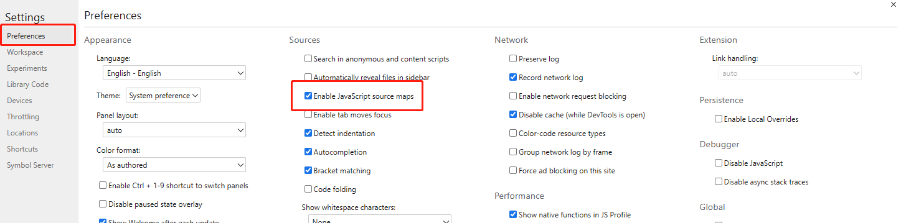
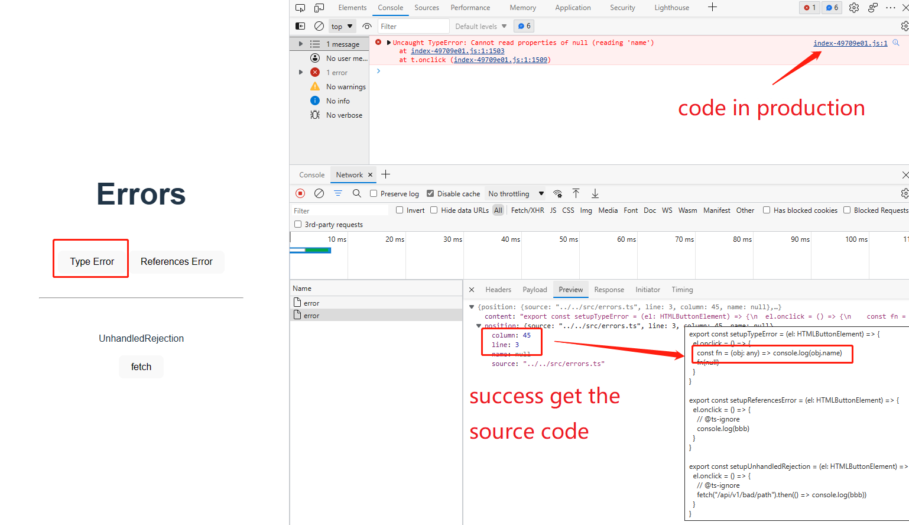

# Front-end Error Monitoring
keywords: **Sourcemap**、**Error monitoring and collection**、**Error organizing and reporting**、**Backend error monitoring and analysis**、**Stack information restoration**

other language: [中文](./README.zh.md)

## 0x00 Why we need to monitor for errors？

In the production environment, most web applications (especially small and medium-sized companies) still don't have (or don't have the cost to implement) perfect unit testing or automation testing, making the program leak numerous bugs in use.
When the application is released to the production environment, bugs can cause poor user experience and even affect the operation of the entire program. Therefore, we need a reliable means to monitor the health of the application, quickly locate the problem and give feedback when bugs occur.

Front-end code is always compiled, transformed obfuscated, and compressed for release to production, making it difficult to locate errors.

**Error-Monitoring System？**

Various errors will occur when the program is running. Without affecting the operation of the program, the errors will be quickly and effectively collected, counted, and fed back to the management center so that the development of a system to find and fix errors more quickly. So that is the error-monitoring system. The general error monitoring system contains three core modules as below:

+ **Error monitoring and collection**：When an error occurs during the program operation, timely monitor the location and type of the error and collect it.
+ **Error organizing and reporting**：Once collected, error messages may be temporarily cached, filtered, simply processed or simply counted, and then reported to the back-end for storage.
+ **Backend error monitoring and analysis**：The error monitoring service is developer friendly and is generally deployed internally to the company. **a)** The monitoring part receives information such as listening errors, active reporting errors, logs, etc. sent by the client, and then stores and counts. **b)** The analysis section presents the collected information and error source information in the form of lists, charts, etc. Easy for developers to read and analyze. **c)** Errors in production environments usually occur after the code has been compiled and obfuscated. In production environment, It difficult to find problems from error messages. Therefore, the analysis section usually also has functions such as **stack information reduction**, **code location**, etc.

## 0x01 Error monitoring and collection

### Regular error types

**1. Regular JavaScript errors**

```javascript
// SyntaxError

// TypeError, not expected type. unhandled empty value ...etc
const fn = (obj) => obj.name
fn(null)

// RangeError

// Network error
// ResourceError script, stylesheet, font file load error
new Image().src = "path/not/exist.png" // or else

// request didn't catch
fetch("api") /* .catch(e => ...)*/

// unhandled async/promise error
const fn = async () => {
  // error
}
new Promise(() => {
  // error
})
```

**2. Vue Error**

by add a global config, errorHandler function.

```javascript
Vue.config.errorHandler = function (err) {
  errorService.vueErrorAdapter(err)
}
```

**3. React ErrorBoundary**

by **componentDidCatch** hook.

```javascript
class ErrorBoundary extends React.Component {
  componentDidCatch(error, errorInfo) {
    errorService.reactErrorAdapter(error, errorInfo);
  }
}
```

### Collect error is not that easy

**1. try/catch** unable to get **syntax error** and **async/promise error** 

```javascript
// Syntax Error ❌
try {
 const notdefined,
} catch(e) {
 console.log('an error occur：', e);
}

// Error in Timer ❌
try {
 setTimeout(() => {
   console.log(notdefined);
 }, 0)
} catch(e) {
 console.log('an error occur：',e);
}
try {
 new Promise((resolve,reject) => { 
   JSON.parse('')
   resolve();
 })
} catch(err) {
 console.error('catch', err)
}
```

**2. window.onerror** able to capture runtime errors, and errors in timer. Exclude syntax errors and resources load errors.

```javascript
window.onerror = function(message, source, lineno, colno, error) {
 console.log('an error occur：',{message, source, lineno, colno, error});
}

// regular javascript error ✅
console.log(notdefined);

// regular javascript error in timer ✅
setTimeout(() => {
 console.log(notdefined);
}, 0)

// syntax error ❌
const notdefined,
     
// resources load error ❌
// 
```

**3. window.addEventListener(“error”)** unable to capture **new Image** and **fetch** errors.

When a resource (such as an image or script) fails to load, **the element that load the resource** will trigger an Event interface type error event, which **does not bubble ** to the window, **but can be captured**. And window.onerror cannot capture the event.

```html
<script>
   window.addEventListener('error', (error) => {
       console.log('an error occur: ', error);
   }, true) 
</script>
// image,script,css can be captured ✅

<script src="resources.js"></script>
<link href="resources.css" rel="stylesheet"/>
<script>
// new Image error can not be captured ❌
new Image().src = 'path/has/error.png'


// fetch error ❌
fetch('api/v1/data')
</script>
```

**4. window.addEventListener("unhandledrejection")** can capture **Promise error**.

```javascript
// global handle Promise error
window.addEventListener("unhandledrejection", function(e){
 console.log('an error occur：', e);
});
fetch('api/v1/data')
```

**5. It will always send a reject promise error inside wrapped fetch API**

```javascript
// It is common in ad-block
const f = window.fetch;
window.fetch = function () {
  const p = f.apply(this, arguments)
  // p.then this new promise chain will always send a reject error
  p.then(function() {
    console.log('hi.');
  })

  return p;
}
```

> This makes a whole process become an infinite loop, which we need to somehow deal with, and break it in one way or another. —— from [**getsentry/sentry-javascript**](https://github.com/getsentry/sentry-javascript)

if we use fetch api to report (report >> reject >> error event collected >> report >> reject ...). So, we need to  get true native fetch API。

```typescript
let cachedFetchImpl: FetchImpl | undefined = undefined

export type FetchImpl = typeof fetch

const isNativeFetch = (func: Function): boolean => {
  return func && /^function fetch\(\)\s+\{\s+\[native code]\s+}$/.test(func.toString())
}

const getNativeFetch = () => {
  if (cachedFetchImpl) return cachedFetchImpl


  if (isNativeFetch(window.fetch)) {
    return (cachedFetchImpl = window.fetch.bind(window))
  }

  const document = window.document
  let fetchImpl = window.fetch

  if (document && typeof document.createElement === 'function') {
    try {
      const sandbox = document.createElement('iframe')
      sandbox.hidden = true
      document.head.appendChild(sandbox)
      const contentWindow = sandbox.contentWindow
      if (contentWindow && contentWindow.fetch) {
        fetchImpl = contentWindow.fetch
      }
      document.head.removeChild(sandbox)
    } catch (e) {
        console.error('Could not create sandbox iframe for pure fetch check: ', e)
    }
  }

  return (cachedFetchImpl = fetchImpl.bind(window))
}
```

And more ways you can get from [getsentry/sentry-javascript/packages](https://github.com/getsentry/sentry-javascript/tree/master/packages)

### Error monitoring and collection

**In the demo, we simply create three functions to collect errors**

```ts
// listener.ts
export interface IReportData {
  lineno: number
  colno: number
  type: string
  message?: string
  stack?: string
}

export const startListener = () => {
  window.onerror = (message = "", url = "", lineno = -1, colno = -1, error) => {
    // console.log("onerror", error)
    reportError({
      type: "onerror",
      lineno,
      colno,
      message: message as string,
      stack: (error as any)?.stack || ""
    })
  }
  window.addEventListener("error", (event) => {
    const { lineno, colno, message } = event
    // console.log("addEventListener", event)
    reportError({
      type: "addEventListener",
      lineno,
      colno,
      message,
      stack: event.error?.stack || ""
    })
  })
  // promise can not get line&column infomation
  window.addEventListener("unhandledrejection", (e) => {
    // console.log("unhandledrejection", e)
    reportError({
      type: "unhandledrejection",
      lineno: -1,
      colno: -1,
      message: e.reason?.message || "",
      stack: e.reason?.stack || ""
    })
  })
}
```

**Send to backend**

```ts
// some error will trigger as least two functions
// so we need make a cache to filter
const cache = new Map()

export const reportError = (data: IReportData) => {
  const key = `${data.lineno}-${data.colno}`
  if (cache.has(key)) return

  cache.set(key, data)

  fetch("http://127.0.0.1:4004/error", {
    headers: new Headers([["Content-Type", "application/json"]]),
    body: JSON.stringify(data),
    method: "POST"
  }).then(() => {
    cache.delete(key)
  })
}
```

## 0x02 Simple server to collect error information

```typescript
import express from "express"
import cors from "cors"

const app = express()

app.use(express.json())
app.use(cors())

app.get("/health", async (req, res) => {
  res.json({
    message: "very well!"
  })
})
app.post("/error", async (req, res) => {
  console.log(req.body)
  /*
  {
    type: 'onerror',
    lineno: 3,
    colno: 41,
    message: "Uncaught TypeError: Cannot read properties of null (reading 'name')",
    stack: "TypeError: Cannot read properties of null (reading 'name')\n" +        
      '    at fn (http://localhost:5173/src/errors.ts:3:41)\n' +
      '    at el.onclick (http://localhost:5173/src/errors.ts:4:5)'
  }
  * */
  res.json({
    message: "ok"
  })
})

app.listen(4004, () => {
  console.log(`Server ready at: http://localhost:4004`)
})
```

After getting the error information and location information, it is time to consider how to map the code of the production environment to the source code. To realize this function, we need a swap file that records the location information before and after compilation, **sourcemap** file.

## 0x03 Code Mapping in file (sourcemap file)

A long time ago, in order to solve the increasingly complex and larger problems of JavaScript scripts, most of the source code usually had to be converted and compressed before being put into the production environment. 

Ultimately, the production code is obfuscated and hard to read：


Such code even if devtools tells you where the error occurred, you can not get any useful information from this. And yes, sourcemap is born to solve these problems.

**Summarily, the sourcemap is an information file that stores the location information of the source code and maps it from the converted code.**

### So, what details in sourcemap？

**sourcemap file format**

```json
{
  "version": 3,
  "file": "sourceMapDemo.js",
  "sourceRoot": "",
  "sources": [
    "sourceMapDemo.ts"
  ],
  "names": [],
  "mappings": ";;;AAAO,IAAM, ...",
  "sourcesContent": [
    ""
  ]
}
```

**version**：sourcemap proposal version, current 3.  
**file**：An optional name of the generated code that this source map is associated with.  
**sourceRoot**：An optional source root, useful for relocating source files on a server or removing repeated values in the “sources” entry. This value is prepended to the individual entries in the “source” field.  
**sources**：A list of original sources used by the “mappings” entry.  
**names**：A list of symbol names used by the “mappings” entry.  
**mappings**：A string with the encoded mapping data.  
**sourcesContent**：optional. source code corresponding to the file in sources field.  

### How mapping data map source code？

#### The “mappings” data is broken down as follows

+ each group representing a line in the generated file is separated by a ";"

+ each segment is separated by a ","

+ each segment is made up of 1,4 or 5 variable length fields. encoded with Base64 [VLQ]([Variable-length quantity - Wikipedia](https://en.wikipedia.org/wiki/Variable-length_quantity)). stored the location information.

e.g: `{ "mappings": ";;;AAAO,IAAM, ..." }`

**AAAO** after three **“;”** shows it start at line 4. **AAAO** and **IAAM** been splited by a **“,”** means first segment and second segment in  line 4. and so on.

#### What is VLQ (Variable-length quantity)？

> A **variable-length quantity** (**VLQ**) is a [universal code](https://en.wikipedia.org/wiki/Universal_code_(data_compression)) that uses an arbitrary number of [binary](https://en.wikipedia.org/wiki/Binary_code) [octets](https://en.wikipedia.org/wiki/Octet_(computing)) (eight-[bit](https://en.wikipedia.org/wiki/Bit) [bytes](https://en.wikipedia.org/wiki/Byte)) to represent an arbitrarily large [integer](https://en.wikipedia.org/wiki/Integer).

The idea behind VLQ is rather simple  (Suppose here the VLQ unit length is 8 bits). Numbers are represented by n 8-bit binary bits in VLQ, the highest bit is the flag bit, 0 means discontinuous, 1 means continuous.

Steps to convert a number into VLQ:

1. Numbers are expressed in binary bits.
2. Splitting numbers in groups of 7 binary bits, with the last group of less than 7, high bits complemented by 0.
3. Setting 1 for each group of the 8th bit (position A) except for the last group of the 8th bit (position A) which is set to 0 to indicate that it is not continuous with the next digits.

<table>
<tr>
    <td>7</td><td>6</td><td>5</td><td>4</td><td>3</td><td>2</td><td>1</td><td>0</td>
</tr>
<tr>
    <td>2^7</td><td>2^6</td><td>2^5</td><td>2^4</td><td>2^3</td><td>2^2</td><td>2^1</td><td>2^0</td>
</tr>
<tr>
    <td>A</td>
    <td colspan="7" style="text-align: center">Bn</td>
</tr>
</table>

In order to indicate the sign of a signed integer, the first segment (lowest 8 bits) is taken as "1(A0 continuous bit) + 6 (data) + 1 (sign bit, 0 positive and 1 negative)":

<table>
<tr>
    <td>7</td><td>6</td><td>5</td><td>4</td><td>3</td><td>2</td><td>1</td><td>0</td>
    <td>7</td><td>6</td><td>5</td><td>4</td><td>3</td><td>2</td><td>1</td><td>0</td>
</tr>
<tr>
    <td>2^7</td><td>2^6</td><td>2^5</td><td>2^4</td><td>2^3</td><td>2^2</td><td>2^1</td><td>2^0</td>
    <td>2^7</td><td>2^6</td><td>2^5</td><td>2^4</td><td>2^3</td><td>2^2</td><td>2^1</td><td>2^0</td>
</tr>
<tr>
    <td>An</td>
    <td colspan="7" style="text-align: center">Bn</td>
    <td>A0=1</td>
    <td colspan="6" style="text-align: center">B0</td>
    <td>P</td>
</tr>
</table>

#### Base64

Base64 is a method of representing binary data as 64 **printable strings**. 2^**6** = 64 i.e. 6 binary bits are used as the unit. The mapping table (common standard) is a sequential mapping of **A-Za-z/=**。（[source code at sdk/encoder/base64.ts](./sdk/encoder/base64.ts))

#### Base64-VLQ

Due to the unit limitation of Base64, the unit of Base64 VLQ is also 6 bits. i.e, the highest bit represents the contiguous and the lower 5 bits represent the actual data.（[source code at  sdk/encoder/vlq.ts](./sdk/encoder/vlq.ts))

#### How mappings data show location infomation

**1. By recording the position of characters before and after conversion**

> “feel **the** force” ⇒ transform ⇒ “**the** force feel”

| Output           | sources        | Input            | names |
|:-----------------|:---------------|:-----------------|:------|
| Line 1, Column 0 | Yoda_input.txt | Line 1, Column 5 | t     |
| Line 1, Column 1 | Yoda_input.txt | Line 1, Column 6 | h     |
| Line 1, Column 2 | Yoda_input.txt | Line 1, Column 7 | e     |

The mappings record the input and output position information and character information of the symbols, fill in the mappings manually to the word **the** for example (line|col|file|line|col)：

`mappings=1|0|Yoda_input.txt|1|5,1|1|Yoda_input.txt|1|6,1|2|Yoda_input.txt|1|7`

**2. Line information improvement**

don’t write output line number each time. Use **“;”** to indicate a line change：

```
feel the force;              	  line other 1;
other line 1;    ⇒ transform ⇒   the force feel;
...                               ...
```

| Output           | sources        | Input            | names |
|:-----------------|:---------------|:-----------------|:------|
| Line 2, Column 0 | Yoda_input.txt | Line 1, Column 5 | t     |
| Line 2, Column 1 | Yoda_input.txt | Line 1, Column 6 | h     |
| Line 2, Column 2 | Yoda_input.txt | Line 1, Column 7 | e     |

Because in many cases the output is condensed into fewer lines than the input (minified JavaScript for example), not having to write the output line location for each entry results in great space savings. The same table we had before can now be encoded as follows：

`mappings=......;0|Yoda_input.txt|1|5,1|Yoda_input.txt|1|6,2|Yoda_input.txt|1|7`

**3. Filename map improvement**

Of course, we can not put the filename **Yoda_input.txt** in each segment. So let’s use field **sources** to store filenames and use the index in mappings data to reference：

 ```json
 {
   "sources": [
     "Yoda_input.txt"
   ],
   "mappings": "...;0|0|1|5,1|0|1|6,2|0|1|7"
 }
 ```

**4. Symbol map improvement**

Same as **filename**. Repeated words can be mapped in the names field.

 ```json
 {
   "sources": [
     "Yoda_input.txt"
   ],
   "names": [
     "t",
     "h",
     "e"
   ],
   "mappings": "...;0|0|1|5|0,1|0|1|6|1,2|0|1|7|2"
 }
 ```

**5. Improvement： use Base64 VLQ to store mappings data**

We got all we need, BUT：

+ we can not use vertical line to separate numbers.
+ The position of a character could be on line 10, column 40, or it could be the 12th filename in sources, or the 126th string in names. Without a vertical line, we don't know the length of each number.

To more efficiently format mappings data and avoid issues such as the display of internationalization characters, we have chosen to use the **Base64 VLQ** encoding technique.

source code here：

```typescript
const base64 = [
  'A', 'B', 'C', 'D', 'E', 'F', 'G', 'H', 'I', 'J', 'K', 'L', 'M', 'N', 'O', 'P', 'Q', 'R', 'S', 'T', 'U', 'V', 'W', 'X', 'Y', 'Z',
  'a', 'b', 'c', 'd', 'e', 'f', 'g', 'h', 'i', 'j', 'k', 'l', 'm', 'n', 'o', 'p', 'q', 'r', 's', 't', 'u', 'v', 'w', 'x', 'y', 'z',
  '0', '1', '2', '3', '4', '5', '6', '7', '8', '9', '+', '/', '='
]
const base64Table: Map<number, string> = base64.reduce((table, n, idx) => table.set(idx, n), new Map())

const enum Vlq {
  Length = 5,
  Base = 1 << Vlq.Length, // 100000 32
  BaseMask = Vlq.Base - 1, // 011111 31
  Continuation = Vlq.Base
}

const encoder = (num: number) => {
  // 1. Add a new bit to the lowest position to indicate positive or negative
  if (num < 0) num = (Math.abs(num) << 1) | 1
  else {
    num <<= 1
  }

  let result = ""
  while (true) {
    const digit = num & Vlq.BaseMask
    result += base64Table.get(num < Vlq.Continuation ? digit : digit | Vlq.Continuation)

    if ((num >>>= Vlq.Length) <= 0) break
  }
  return result
}

const encode = (num: number | number[]) => {
  if (typeof num === "number") return encoder(num)
  else {
    return num.reduce((pre, n) => pre += encoder(n), "")
  }
}

// online test: https://www.murzwin.com/base64vlq.html
console.log(encode(7)) // O
console.log(encode(16)) // gB
console.log(encode(1200)) // grC
console.log(encode(-17)) // jB
console.log(encode([710, 0, 0, 0])) // ssBAAA
```

**6. Column information improvement**

If the column information always uses absolute position, mappings will store too many large numbers in each field (e.g. column 112, column 116, column 120), if the first field in each row keeps absolute position information and subsequent column information is stored in relative position, the numbers can be made much smaller (e.g. column 4, column + 6 = 10, column + 12 = 22 in that order).

Because of the variable length of the data and factors such as positive and negative markers, **this optimization requires VLQ encoding as a prerequisite**.

**7. Symbol and character improvement**

```
feel the force;                   l other 1;
other line 1;    ⇒ transform ⇒    t force feel;   (save in  names: [the, line])
read the line;                     read t l
...                                ...
```

In practice code conversion is much more complex than this example. To reduce code size, words are often extracted into shorter alphanumeric combinations.

| Output           | sources        | Input            | names          |
|:-----------------|:---------------|:-----------------|:---------------|
| Line 2, Column 0 | Yoda_input.txt | Line 1, Column 5 | the => t => 0  |
| Line 1, Column 0 | Yoda_input.txt | Line 2, Column 6 | line => l => 1 |
| Line 3, Column 7 | Yoda_input.txt | Line 1, Column 9 | line => l => 1 |

Take the words **the**, **line** as an example, the position change and character replacement are performed before and after the conversion, respectively, and the last bit adds a symbolic mapping bit to index the replaced character. 

The position information is recorded in the table above, then the result in sourcemap is as follows (omitting other characters):

```json
{
  "names": [
    "the",
    "line"
  ],
  "sources": [
    "Yoda_input.txt"
  ],
  "mappings": "0|1|2|6|1;0|1|1|5|0;7|1|1|9|1"
}
```

source code（[complete code here](./sdk/sourcemap.ts)）：

```typescript
export default class SourceMap {
  files: string[] = []
  mappings: Mapping[] = []
  names: string[] = []
  target: string
  sourceRoot?: string
 
  // relative position, and encode
  toMap(sourceContent?: string): string {
    const mappingArray = this.mappings.sort((a, b) => a.offset - b.offset)
    let previousOffset = 0
    let previousLine = 0
    let previousColumn = 0
    let previousFile = 0
    let previousName = 0
 
    const mappings = mappingArray.map(instance => {
      const offset = instance.offset - previousOffset
      const line = (instance.line - 1) - previousLine
      const column = (instance.column - 1) - previousColumn
      const file = instance.fileIndex - previousFile
      let name: number | undefined = undefined
      const n = instance.name
      if (n) {
        name = n - previousName
        previousName = n
      }
      previousOffset = instance.offset
      previousLine = (instance.line - 1)
      previousColumn = (instance.column - 1)
      previousFile = instance.fileIndex
 
      return encode([offset, file, line, column]) + (name === undefined ? "" : encode(name))
    }).join(",")
 
    const mapData: SourceMapData = {
      version: "3",
      sources: this.files,
      names: this.names,
      mappings
    }
    if (sourceContent) {
      mapData.sourceContent = sourceContent
    }
    if (this.target) mapData.file = this.target
    if (this.sourceRoot) mapData.sourceRoot = this.sourceRoot
 
    return JSON.stringify(mapData)
  }
}
```

### enable sourcemap in brower

To use sourcemap, you only need to add a line of comments at the end of the compiled and converted code file:

`//# sourceMappingURL=/path/to/file.js.map`

At the same time, a browser that supports sourcemap needs to enable the sourcemap in settings: 



## 0x04 Stack information restoration

After knowing how to report errors in the production environment and the principle of sourcemap, we will start to restore the error location of the source code from the error message.

**Use a third-party library [source-map](https://github.com/mozilla/source-map) to parse sourcemap and locate**

### sourcemap prepare

First, we need to generate a sourcemap file when publishing the application, and host it to our collection server (here is localhost:4004). 

I used bundle tool here is vite, so I just need to set`build.sourcemap = "hidden"`. (`build.sourcemap` has three value: “true， false， hidden”. The different is both **hidden** and **true** generate sourcemap file, but hidden wouldn't add sourcemap url comment at end of the output source code.) 

For easy to use，I directly copy the sourcemap file to the side of the server code app.ts:

```
server
  | app.ts  // express server
  | frontend.js.map
```

frontend.js.map

```json
{
  "version": 3,
  "file": "index-49709e01.js",
  "sources": [
    "../../../../sdk/handler/utils/reporter.ts",
    "../../../../sdk/handler/services/listener.ts",
    "../../src/errors.ts",
    "../../src/main.ts"
  ],
  "sourcesContent": [
    "export interface IReportData {\n  lineno: number\n  colno: number\n ......",
    "import { reportError } from \"../utils/reporter\";\n\nexport const ......",",
    "export const setupTypeError = (el: HTMLButtonElement) => {\n  el.onclick = () => ......",",
    "import { startListener } from \"@lib/error-handler\";\n\nimport {\n  setupReferencesError, ......","
  ],
  "names": [
    "cache",
    "reportError",
    "data",
    "key",
    "..."
  ],
  "mappings": "ssBAQA,MAAMA,MAAY..."
}

```

### code restoration

Update error collection API, use lib  [source-map](https://github.com/mozilla/source-map) to restore code location.  It is simple:

1. read sourcemap file.
2. wait the location information in error report. 
3. use source-map lib to reveal location in source code. That’s it.

```typescript
import sourceMap, { RawSourceMap } from "source-map"

export const getPosition = async (map: RawSourceMap, rolno: number, colno: number) => {
  const consumer = await new sourceMap.SourceMapConsumer(map)

  if (colno < 0 || colno < 0) return
  const position = consumer.originalPositionFor({
    line: rolno,
    column: colno
  })

  const content = position.source ? consumer.sourceContentFor(position.source) : ""

  return { position, content }
}

app.post("/error", async (req, res) => {
  const { lineno, colno  } = req.body
  
  // read sourcemap file and convert to json object
  fs.readFile("./frontend.js.map", async (err, data) => {
    if (err) return res.json({ message: "failed" })

    const raw = JSON.parse(data.toString())

    const result = await getPosition(raw, lineno, colno)
    console.log("result", result)
    res.json(result)
  })
})

```



## References

### Sourcemap

1. sourcemaps under the hood – VLQ, Base64 and Yoda. (https://learn.microsoft.com/en-us/archive/blogs/davidni/source-maps-under-the-hood-vlq-base64-and-yoda)
2. sourcemap Revision 3 Proposal. (https://docs.google.com/document/d/1U1RGAehQwRypUTovF1KRlpiOFze0b-_2gc6fAH0KY0k/edit) (https://docs.google.com/document/d/1U1RGAehQwRypUTovF1KRlpiOFze0b-_2gc6fAH0KY0k/edit)
3. SourceMap详解. (https://juejin.cn/post/6948951662144782366)
4. JavaScript sourcemap 详解. (http://www.ruanyifeng.com/blog/2013/01/javascript_source_map.html)
5. sourcemap 的原理探究. (https://github.com/wayou/wayou.github.io/issues/9)

### Base64，VLQ，Base64 VLQ

1. Variable-length quantity. (https://en.wikipedia.org/wiki/Variable-length_quantity)
2. GITHUB js-base64. (https://github.com/dankogai/js-base64/tree/main)
3. vlq. (https://juejin.cn/post/7098014484588920868#heading-3)
4. base64编码详解. (https://zhuanlan.zhihu.com/p/339477329)
5. VLQ & Base64 编码方式原理以及代码实现. (https://www.cnblogs.com/echoyya/p/16726545.html)
6. 一文搞懂base64编码足矣. (https://juejin.cn/post/7168809452508807182)
7. 手动实现 source-map 中生成 mapping 属性的base64、VLQ及base64-VLQ 编码方法. (https://juejin.cn/post/7011156613268504606#heading-10)
8. VLQ编码. (https://github.com/D-kylin/note/blob/master/VLQ%E7%BC%96%E7%A0%81.md)

### Error Monitoring

1. 一篇讲透自研的前端错误监控. (https://juejin.cn/post/6987681953424080926#heading-11)
2. SourceMap 与前端异常监控. (https://mp.weixin.qq.com/s/BbvJ-OfcS7Sa-e0Zq6iF1w)
3. 超详细！搭建一个前端错误监控系统.  (https://zhuanlan.zhihu.com/p/51446011)
4. 如何做前端异常监控？ (https://www.zhihu.com/question/29953354/answer/2520764897)
5. 一步一步搭建前端监控系统：JS错误监控篇. (https://developer.aliyun.com/article/707873)
