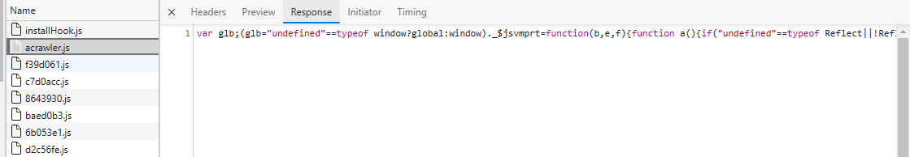

# 浅析前端错误监控

**为什么我们需要对错误进行监控？**

在生产环境（尤其中小型公司），大多数web应用还是没有进行或者完善单元测试或者自动化测试，使得程序在实际使用中会泄露众多BUG。
当应用已经发布到生产环境时再解决BUG还是太晚了。而前端代码总是通过混淆后发布到生产环境，使得定位错误困难重重。  
所以，我们需要一种可靠的手段监控应用的健康，并在发生错误时迅速的定位问题和反馈问题。

这篇文章介绍的核心内容：**Source Map**、**Error handling**、**Error report**

## 什么是Source Map？

很早之前，为了解决JavaScript脚本越来越复杂且越来越大的问题，通常大部分源码都要通过转换、压缩等方法才能投入到生产环境。通常的情况是**压缩**、**文件合并**以减少HTTP请求、**语言转换**（如CoffeeScript、Typescript到JavaScript）。  

最后生产环境得到的代码的是混淆的并且难以阅读的：



这样的代码即时devtools告诉你错误发生在了什么位置，你也无法从这些信息中得到什么有用信息，而source map就是为了解决这些问题。**简单来讲，Source Map就是一个信息文件，存储了代码的位置信息，能从转换后代码的位置信息映射到转换前代码的位置信息上**。

### Source Map 文件格式

```json
{
  "version": 3,
  "file": "sourceMapDemo.js",
  "sourceRoot": "",
  "sources": [
    "sourceMapDemo.ts"
  ],
  "names": [],
  "mappings": ";;;AAAO,IAAM, ...",
  "sourcesContent": [""]
}
```

**version**：Source Map的版本，目前为3。

**file**：转换后的文件名。

**sourceRoot**：转换前的文件所在的目录。如果与转换前的文件在同一目录，该项为空。

**sources**：转换前的文件。该项是一个数组，表示可能存在多个文件合并。

**names**：转换前的所有变量名和属性名。

**mappings**：记录位置信息的字符串，下文详细介绍。

**sourcesContent**：源代码内容（一般没用，当代码无法hosted或者程序性获取的时候）。

### mappings 如何映射文件信息？

#### mappings的结构

**Source Map**实现映射的关键便是**mappings**属性。mappings是一个很长的字符串，分为三种标志：

**第一种是行对应**，以分号（;）结尾，每个分号对应转换后源码的一行（group **组**）。

**第二种是位置对应**，以逗号（,）分隔，每个逗号隔开的一串字符对应转换后源码的一个位置（segment **段**）。

**第三种是位置转换**，逗号分隔开的字符串。以Base64 [VLQ编码]([Variable-length quantity - Wikipedia](https://en.wikipedia.org/wiki/Variable-length_quantity))表示，代表该位置对应的转换前的源码位置。

如上格式，三个分号（**;**）表示前三行没有映射（或不需要），第四行的位置信息从**AAAO**开始且表示第一个位置信息，逗号（**,**）后的下一串字符**IAAM**表示第二个位置，知道下一个分号开始，表示第五行位置信息，依次类推。

#### VLQ编码

VLQ是用来表示任意大小数字的编码方式。VLQ的概念很简单（假设这里VLQ单位长度为8 bits）: 数字在VLQ中以n个8位二进制位表示，最高位为标志位，0表示不连续，1表示连续。

1. 将数字以二进制位表示;
2. 将数字以7位二进制位一组进行拆分，最后一组不足7位高位补0；
3. 除最后一组第8位（位置A）补0表示不与接下来的数字连续外，前面的每组第8位（位置A）补1表示；

<table>
<tr>
    <td>7</td><td>6</td><td>5</td><td>4</td><td>3</td><td>2</td><td>1</td><td>0</td>
</tr>
<tr>
    <td>2^7</td><td>2^6</td><td>2^5</td><td>2^4</td><td>2^3</td><td>2^2</td><td>2^1</td><td>2^0</td>
</tr>
<tr>
    <td>A</td>
    <td colspan="7"style="text-align: center">Bn</td>
</tr>
</table>

在完整的VLQ编码中，为了表示数字的正负，则将第一段（最低位）取 1（A0连续位）+ 6（data）+ 1（符号位，0正1负）：

<table>
<tr>
    <td>7</td><td>6</td><td>5</td><td>4</td><td>3</td><td>2</td><td>1</td><td>0</td>
    <td>7</td><td>6</td><td>5</td><td>4</td><td>3</td><td>2</td><td>1</td><td>0</td>
</tr>
<tr>
    <td>2^7</td><td>2^6</td><td>2^5</td><td>2^4</td><td>2^3</td><td>2^2</td><td>2^1</td><td>2^0</td>
    <td>2^7</td><td>2^6</td><td>2^5</td><td>2^4</td><td>2^3</td><td>2^2</td><td>2^1</td><td>2^0</td>
</tr>
<tr>
    <td>An</td>
    <td colspan="7" style="text-align: center">Bn</td>
    <td>A0=1</td>
    <td colspan="6" style="text-align: center">B0</td>
    <td>P</td>
</tr>
</table>

因此，在对数据（二进制）进行编码时，会取7的倍数-1为一组进行编码，分别的正负位和连续位进行补位凑满8位。当然，VLQ只是一种编码概念，像其他引擎（比如Unreal将符号位设置在首段最前面）也可能将段倒置逆序等。

#### Base64编码

Base64是以64个**可打印字符串**来表示二进制数据的方法。 2^**6** = 64 即采用6位二进制位为单元。映射表（常用标准）即按顺序的**A-Za-z/=**映射。（[源码在sdk/encoder/base64.ts](./sdk/encoder/base64.ts))

#### Base64-VLQ

由于Base64的单元限制，故Base64 VLQ的单位也是6位，即最高位表示连续，低5位表示实际数据。（[源码在sdk/encoder/vlq.ts](./sdk/encoder/vlq.ts))

### 启用Source Map
